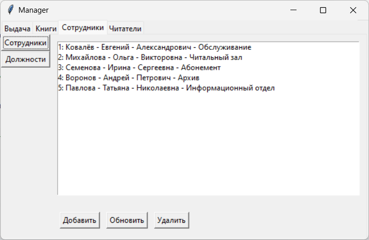
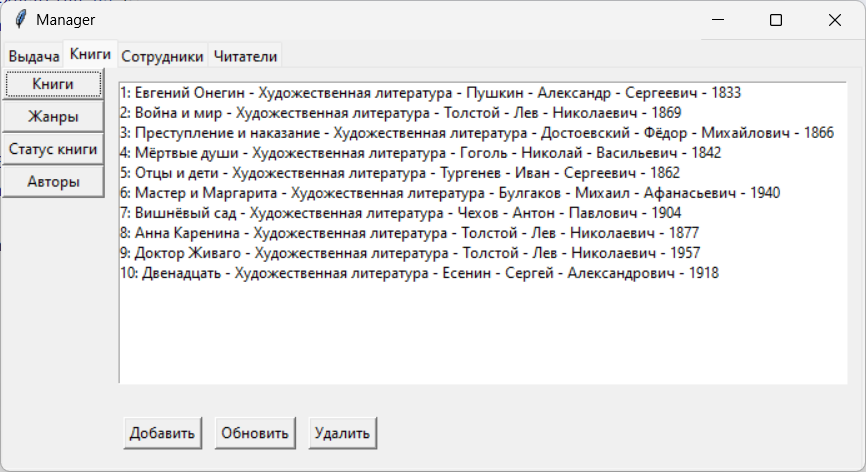
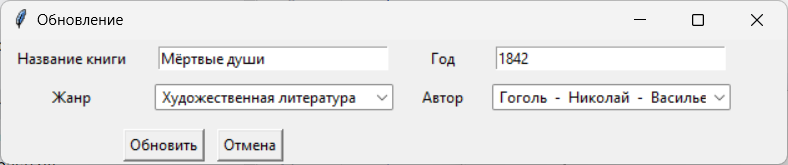

# Library Management System
A simple desktop example application for managing library operations, built with Python and Tkinter.
## Features
- Manage books, authors, genres, and book statuses
- Track readers and borrowed books
- Manage librarians and departments
- Simple and intuitive GUI
- SQL database backend
## Technologies Used
- Python 3
- Tkinter (GUI)
- MySQL (Database)
- Object-oriented design
### Database Tables
- **Books**: Stores book information (title, author, genre, year)
- **Authors**: Author details (last name, first name, middle name)
- **Genres**: Book genres
- **Book Statuses**: Status of books (available, borrowed, reserved, lost)
- **Readers**: Library members
- **Departments**: Library departments
- **Librarians**: Staff information
- **Borrowed Books**: Tracking book loans
### Application Structure
- **Main Application**: `app_main.py` - Handles the main window and tabs
- **Frames**: Organized by functionality (Books, Staff, Readers, etc.)
- **Displays**: Individual components for each table (CRUD operations)
- **Database Handler**: Manages all database operations
### Screenshot

